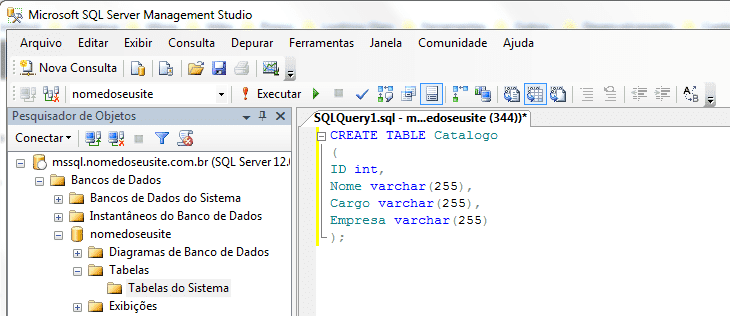

# Banco de dados

### Introdução a Banco de dados

- SGBD (Sistema de Gerenciamento de Banco de Dados)

  Conjunto de softwares e ferramentas que faz a interação entre aplicações, usuários e o banco de dados. Ex: MySQL Server, Oracle Database.
  
  - Vantagens:
    * Controle centralizado de dados.
    * Controle da redundância.
    * Compartilhamento de dados.
    * Facilidade de acesso aos dados.
    * Independência de dados.
 
- Administrador do Banco de Dados

  Função: Garantir que os dados estejam seguros e com desempenho satisfatório, realizar procedimentos de backup, utiliza a abstração de dados.
  
    - Abstração de dados: é possível esconder certos "detalhes" sobre como os dados estão armazenados e como é realizada a manutenção, para facilitar o entedimento do usuário.
      * Níveis de abstração:
        - Nível físico: Descreve como os dados estão armazenados. Este nível é o mais baixo.
        - Nível lógico: Está acima do nível físico e descreve quais dados estão armazenados no Banco de Dados e quais são suas relações.
        - Nível View: Esse nível pode ser visto pelo usuário de diversas formas pois quem opera são os sistemas de aplicativo.

- Etapas de um projeto de Banco de Dados:
   1. Definição do sistema.
   2. Criação do projeto conceitual, lógico e físico.
   3. Implementação do banco de dados.
   4. Carga ou conversão de dados.
   5. Conversão de aplicação.
   6. Teste e validação.
   7. Operação.
   8. Monitoramento e manutenção.
   
- Modelagem de dados

  É a junção de ferramentas que possibilitam para descrição dos dados, sua semântica, relações e restrições de consistência. É fundamental para a criação da estrutura de um banco de dados.
  Consiste em 3 etapas:
  
  1. Modelo conceitual
  
  
  
  2. Modelo Lógico
  
  
  
  3. Modelagem Física
  
  
  
  
  
 - Linguagem SQL
 
  A linguagem SQL é um padrão de linguagem de consulta de banco de dados que usa uma combinação de construtores em álgebra e cálculo relacional 
  e possui as seguintes características principais: 
    
  - DDL(Linguagem de Definição de Dados)
      * Comandos DDL
        Conjunto de comandos responsáveis pela criação, alteração e deleção da estrutura das tabelas e índices de um sistema.
        - Formado por tabelas.
        - Linhas representam os registros(tuplas).
        - Colunas representam atributos(campos).
        Os comandos DDL são: 
          * CREATE - Criação de estrutura.
          * ALTER - Alterar estrutura.
          * DROP - Permite remover ou excluir uma estrutura.
          
 - DML(Lingagem interativa de Manipulação de Dados)
 
      Os comandos DML são:
      
      * INSERT - Adiciona dados na tabela do Banco de Dados.
          ```sql
          INSERT INTO nome-tabela (nome-coluna, nome-tabela)
          VALUES (relação dos valores a serem inseridos);
          ```
          
      * UPDATE - Atualiza os dados.
        ```sql
          UPDATE nome-tabela 
          SET nome-coluna = novo-conteudo-para-o-campo;
          ```
      
      * DELETE - Deleta um dado do banco.
        ```sql
          DELETE FROM nome-tabela
          WHERE condição;
          ```
      * SELECT - Realiza buscas em um banco de dados.
        ```sql
          SELECT *
          FROM nome-tabela
          WHERE condição;
          ```
        - Operadores
        ```
        =  !=  <>  > !> <  !<  >=  <=
        ```
  - Banco de Dados NoSQL
    
    - Introdução a Banco de Dados NoSQL
      
      Consiste em SGBD não relacionais projetados para gerenciar grandes volumes de dados e que disponibilizam estruturas e interfaces de acesso simples.
      
   - Linguagem NoSQL -MongoDB
     MongoDB é um Banco de Dados orientado a documentos. Possui alta performance, não possui esquemas, JSON.
     
      
   
